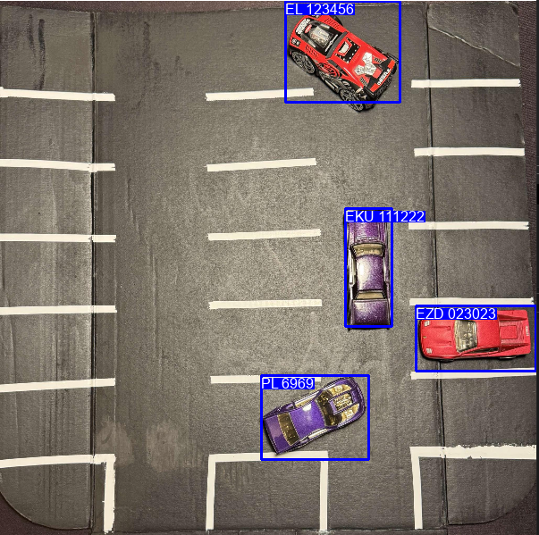
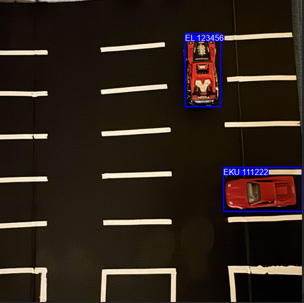
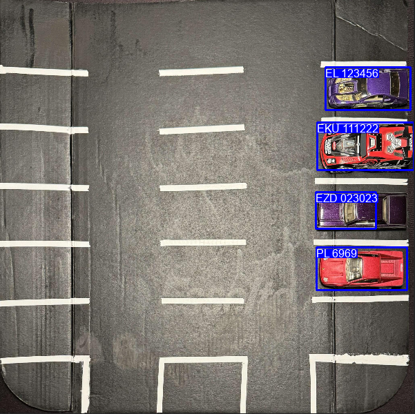
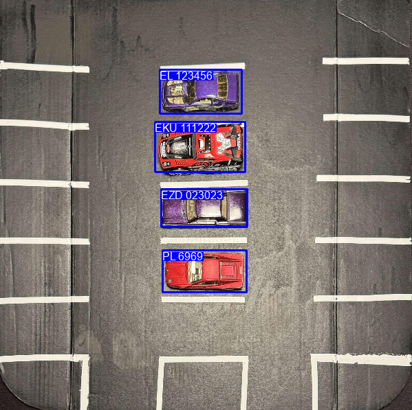
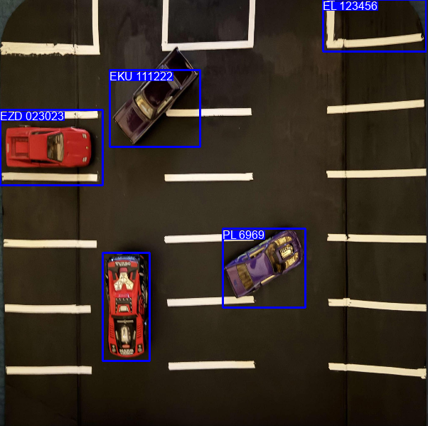
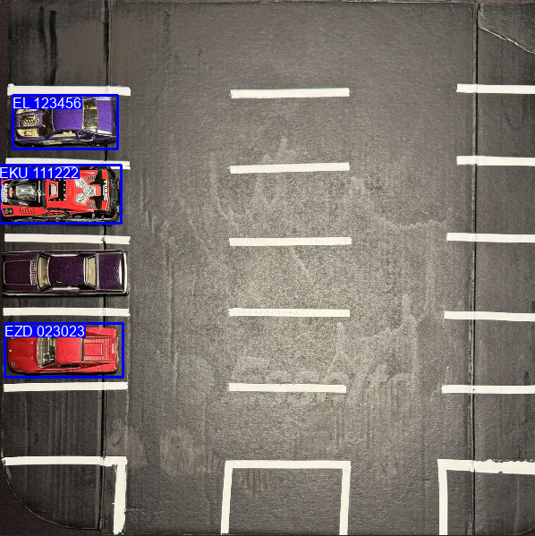
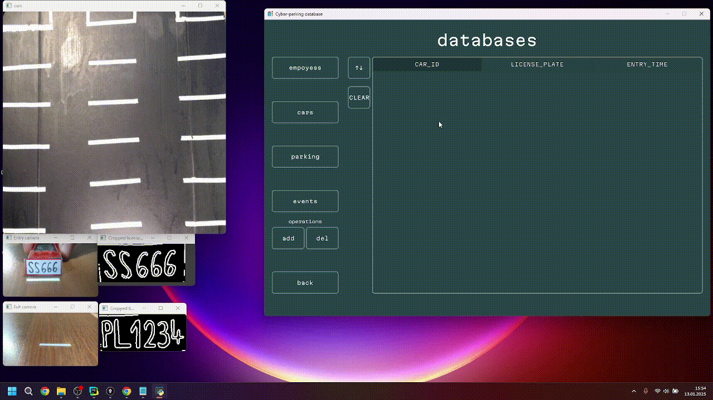
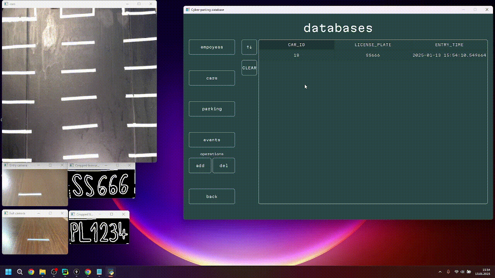

# Parking Car Detector
Part of Cyber Parking App for monitoring car parking from a bird's eye view.  
It allows to show licence plates of all cars in the parking from the top view and track their current position while moving.  

 
 
 

# Key Features:
  * Distinguishing cars from other objects
  * Monitoring the current positions of cars in the parking lot using the main camera
  * Adding and removing vehicles currently in the parking lot to/from the database
  * Storing the current positions of cars in the parking lot until they leave
  * Highlighting car positions with a blue bounding box
  * Assigning a license plate number to each detected vehicle
  * Displaying all detected cars along with their license plates and bounding boxes in the application window

 
 
 

# Screenshots:
## Detecting cars:
  
  
  
  

## Badly detected cars:
Sometimes app doesn't detect everything as it should, the parking lot should well illuminated to detect cars perfectly.  
  
  

 
 
 

# Whole Cyber Parking App Demo:
Part of app that is presented in this repository was used in bigger project as a top-view camera of the parking lot. 
Here will be some short videos (as gifs) showcasing most key features of this app. 
All videos will have:   
* Database window on the right
* Main camera window in the top left corner
* Entry camera window with the text that it is seeing next to it, in the down left corner
* Exit camera window with the text that it is seeing next to it, in the down left corner below entry camera window

 

## Detecting licence plates of cars:
The entry camera detects numbers and letters from the licence plate and show them.  
If the licence plate matches the allowed licence plate from the database, it is added to the table with current cars on the parking lot, and the entry gate opens.   
  

## Car entering parking lot:
After car enters the parking lot, it is immediately detected by the top-down camera.  
From now on it will have blue bounding box around it and its licence plate number.  
Its current position while moving will be tracked by the camera.    
  

## More cars entering parking lot:
As more cars enter the parking lot, we can see that the camera still correctly tracks position of each induvidual car.  
  

## Car leaving parking lot:
As the car leaves the parking lot, the top-down camera removes it from cars that its tracking.  
The exit camera detects the licence plate and removes the car from the database.   
  

## Cars entering and leaving parking lot at the same time:
The cars can simultaneously enter and leave the parking lot at the same time.   
  
